# go-qrcode 🎨

[](https://github.com/farizfadian/go-qrcode/actions/workflows/ci.yml)
[](https://go.dev/)
[](LICENSE)
[](https://goreportcard.com/report/github.com/farizfadian/go-qrcode)
[](https://github.com/farizfadian/go-qrcode/releases)

**Styled QR codes for Go** — per-module dot shapes, independently styled and
coloured finder patterns, a decorated centre logo, and identical geometry from
both a raster and an SVG renderer. Other Go QR libraries give you a logo *or* a
colour scheme; this one aims at the whole visual surface, and proves every shape
still scans with a round-trip decode test.

> An idea from [Fariz](https://github.com/farizfadian), built with
> [Claude AI](https://claude.ai).

---

## 🖼️ What it looks like

| Default | Independent colours | Brand colour | Wider quiet zone |
|:---:|:---:|:---:|:---:|
| 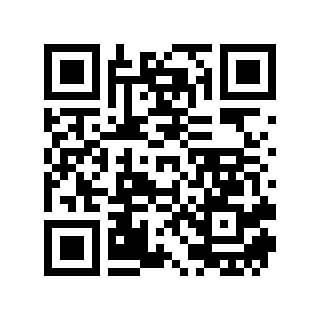 | 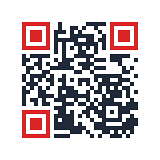 | 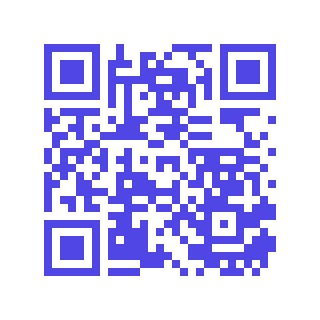 | 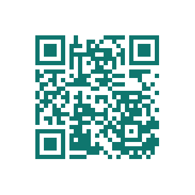 |
| zero-value options | dots and finders coloured separately | one custom foreground | `Margin: 8` |

Every image on this page is decoded by a real QR reader in CI before it ships.

### The twelve dot shapes

| `square` | `dot` | `dot-small` | `tile` |
|:---:|:---:|:---:|:---:|
| 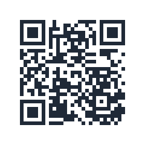 | 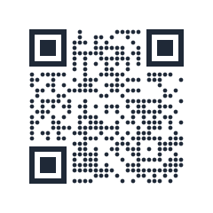 | 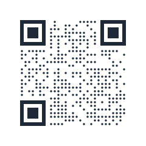 | 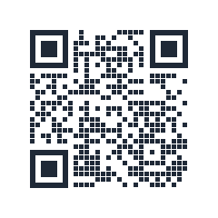 |

| `rounded` | `diamond` | `star` | `fluid` |
|:---:|:---:|:---:|:---:|
| 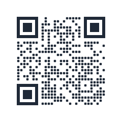 | 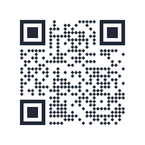 | 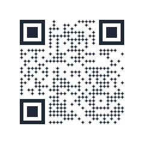 | 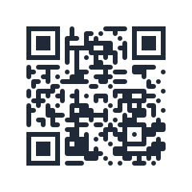 |

| `fluid-line` | `stripe` | `stripe-row` | `stripe-column` |
|:---:|:---:|:---:|:---:|
| 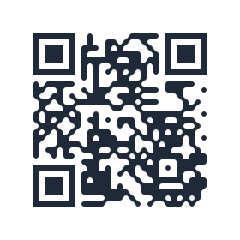 | 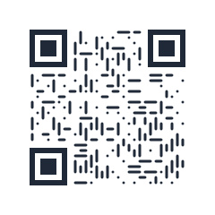 | 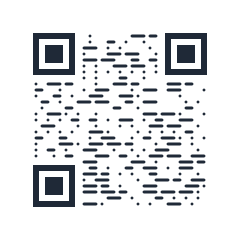 | 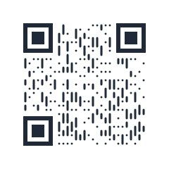 |

`fluid`, `fluid-line` and the three `stripe` shapes are **neighbour-aware**: a
module's figure depends on what surrounds it, so runs merge into continuous
strokes instead of staying as separate marks.

### The seven finder-pattern shapes

Shown in red against grey dots so the finder styling is easy to see.

| `square` | `rounded` | `circle` | `rounded-circle` |
|:---:|:---:|:---:|:---:|
| 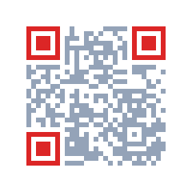 | 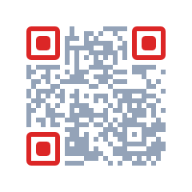 | 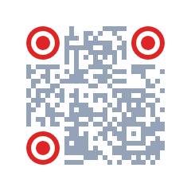 |  |

| `circle-rounded` | `circle-star` | `circle-diamond` | |
|:---:|:---:|:---:|:---:|
| 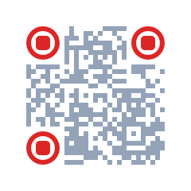 | 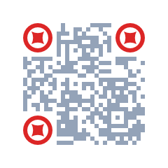 | 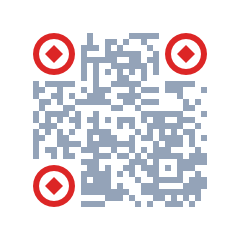 | |

All **84 combinations** of dot shape and finder shape are covered by a decode
test.

---

## 🎯 Why this library?

Go already has QR libraries. Here is the honest comparison that led to this one:

| Library | What it gives you | What it is missing |
|---|---|---|
| `skip2/go-qrcode` | simple, popular, colours | no logo, no styling, no SVG |
| `yeqown/go-qrcode/v2` | logo, gradient, circle cells, halftone | only 2 cell shapes, **no finder-pattern styling**, **no SVG** |
| `piglig/go-qr` | pure Go, PNG + SVG, centred logo | no styling at all |
| `boombuler/barcode` | 11 symbologies, mature | no styling, **no SVG** |
| **`farizfadian/go-qrcode`** | dot shapes, **styled finder patterns**, decorated logo, **PNG + SVG from one geometry** | fewer symbologies — QR only |

If three lines of `yeqown/go-qrcode/v2` already solve your problem, use that.
This library exists for the case where the QR code is part of your design, not
just a link.

**Design principles**

- ✅ **Two runtime dependencies, and CI enforces it** — `piglig/go-qr` and
  `golang.org/x/image`, nothing more. The test decoder never reaches your build.
- ✅ **Go 1.22 floor** — dependencies are pinned so upgrading this library never
  forces your toolchain forward.
- ✅ **Zero-value options work** — only `Content` is required.
- ✅ **Errors, never panics** — everything is validated in `New`.
- ✅ **Safe to share** — a `*QR` is immutable, so one value can render from many
  goroutines at once.
- ✅ **If it does not scan, it is a bug** — every shape has a round-trip decode
  test against a real QR reader.

---

## 📦 Installation

```bash
go get github.com/farizfadian/go-qrcode
```

Requires Go 1.22 or newer.

---

## 🚀 Quick Start

```go
package main

import (
	"log"

	"github.com/farizfadian/go-qrcode/qr"
)

func main() {
	q, err := qr.New(qr.Options{Content: "https://example.com"})
	if err != nil {
		log.Fatal(err)
	}
	if err := q.WritePNGFile("qr.png"); err != nil {
		log.Fatal(err)
	}
}
```

That is the whole thing. Every option other than `Content` has a working
default, so this produces a conventional black-on-white code, 380 pixels
square, with the four-module quiet zone the QR specification requires.

---

## 📖 Usage Guide

### 1. Where the image goes

`New` gives you a value; you choose how to get bytes out of it.

```go
q, err := qr.New(qr.Options{Content: "https://example.com"})

// Straight to a file
err = q.WritePNGFile("qr.png")

// To any io.Writer — an HTTP response, a buffer, a pipe
err = q.PNG(w)
err = q.JPEG(w, 92)   // quality 1-100
err = q.SVG(w)

// As a string, handy for embedding in HTML
markup, err := q.SVGString()

// As a Go image, if you want to composite it into something larger
img := q.Image()
```

Serving one over HTTP is four lines:

```go
func handler(w http.ResponseWriter, r *http.Request) {
	q, err := qr.New(qr.Options{Content: r.URL.Query().Get("url")})
	if err != nil {
		http.Error(w, err.Error(), http.StatusBadRequest)
		return
	}
	w.Header().Set("Content-Type", "image/png")
	q.PNG(w)
}
```

### 2. Size and quiet zone

```go
q, _ := qr.New(qr.Options{
	Content: "https://example.com",
	Width:   512, // output image size in pixels; default 380
	Margin:  4,   // quiet zone in MODULES, not pixels; default 4
})
```

**What is a module?** One of the little squares. A QR code is a grid of them,
and the grid gets bigger as your content gets longer.

**What is the quiet zone?** The blank border. Scanners need it to find the code
at all. The specification requires **four modules**, and that is the default
here. Do not reduce it below four unless you know exactly why.

`Width` is the size of the *image*. The module size is rounded down to a whole
number of pixels and the code is centred, so the leftover pixels quietly widen
the quiet zone. That is deliberate: whole-pixel modules keep the edges sharp,
which measurably decodes better than stretching modules to fill the width
exactly.

If `Width` is too small to give every module at least one pixel, `New` returns
`ErrWidthTooSmall` rather than emitting a smudge.

### 3. Colours

```go
q, _ := qr.New(qr.Options{
	Content:    "https://example.com",
	Foreground: "#1f2937", // everything, unless overridden below
	Background: "#ffffff",
	Dots:       qr.DotOptions{Color: "#1f2937"},    // just the data modules
	Corners:    qr.CornerOptions{Color: "#dc2626"}, // just the three finders
})
```

Hex works with or without the `#`, in 3, 4, 6 or 8 digits. `"#00000000"` gives a
**transparent background**.

`New` refuses a scheme that cannot be read, and both limits were measured
against a real decoder rather than guessed:

- **The foreground must be darker than the background.** A light-on-dark
  "inverted" code has excellent contrast and still will not scan — the
  specification assumes dark modules on a light field, and readers look for that
  pattern. Every inverted sample tested failed to decode, at contrast ratios up
  to 21. You get `ErrInvertedPolarity`.
- **Contrast must reach a ratio of 3.5.** Sweeping a grey foreground against
  white, 3.54 was the lowest ratio that still decoded and 2.96 the highest that
  failed. Below the floor you get `ErrLowContrast`, naming the ratio.

That floor is a best case: clean pixels read by software. A phone camera at an
angle in poor light needs far more, so aim for 4.5 or better in print. Dots and
finder patterns are checked separately, so a scheme whose finders wash out is
caught even when its dots are fine.

### 4. Error correction

QR codes carry redundant data so they still read when partly damaged, dirty or
covered. That is the error-correction level.

| Level | Recovers | Use when |
|---|---|---|
| `qr.ECCLow` | ~7% | the code lives on a clean screen |
| `qr.ECCMedium` | ~15% | general print |
| `qr.ECCQuartile` | ~25% | the code may get scuffed |
| `qr.ECCHigh` | ~30% | a logo covers the middle, or the surface is rough |

```go
q, _ := qr.New(qr.Options{Content: "...", ECC: qr.ECCHigh})
```

Leave `ECC` unset and the library chooses for you: short content gets the
highest protection because there is room for it, and longer content steps down
so the symbol does not grow. A bigger symbol at the same pixel width means
smaller modules, which is *harder* to scan — so more redundancy is not always
better. You can read back what was actually used:

```go
fmt.Println(q.ECC())      // "M"
fmt.Println(q.Modules())  // 29 - the grid size, excluding the quiet zone
```

### 5. Shapes

```go
q, _ := qr.New(qr.Options{
	Content: "https://example.com",
	Dots:    qr.DotOptions{Type: qr.DotSquare},
	Corners: qr.CornerOptions{Type: qr.CornerSquare},
})
```

Ask the library which shapes your build supports rather than guessing:

```go
fmt.Println(qr.DotTypeNames())    // [square]
fmt.Println(qr.CornerTypeNames()) // [square]
```

A shape that is named in the specification but not yet implemented is
**rejected** with `qr.ErrUnknownShape`, listing what is available. It will not
silently draw squares and let you ship a design you did not ask for.

### 6. Handling errors

Everything is validated in `New`, so a `*QR` you hold is always renderable.

```go
q, err := qr.New(opts)
switch {
case errors.Is(err, qr.ErrNoContent):
	// Content was empty
case errors.Is(err, qr.ErrWidthTooSmall):
	// Width cannot hold the module count plus the quiet zone
case errors.Is(err, qr.ErrBadColor):
	// A colour string could not be parsed
case errors.Is(err, qr.ErrContentTooLong):
	// Does not fit even in a version 40 symbol at this ECC level
case errors.Is(err, qr.ErrUnknownShape):
	// This build does not implement that dot or corner shape
case err != nil:
	// Anything else
}
```

### 7. Adding a logo

```go
q, err := qr.New(qr.Options{
	Content: "https://example.com",
	Width:   720,
	Logo: &qr.LogoOptions{
		Path:         "logo.png",  // or Image, or Reader — exactly one
		Size:         0,           // 0 = as large as the error correction allows
		Radius:       12,          // round the logo image's own corners
		BorderWidth:  12,          // the frame around it
		BorderRadius: 18,
	},
})
```

A logo covers data, so the library does three things for you:

1. **Forces the highest error-correction level** when you did not choose one,
   because that is what pays for the covered modules.
2. **Never draws the modules underneath.** They are excluded before rendering,
   so nothing pokes out from under a rounded corner.
3. **Refuses a logo that is too big.** If it covers more than the error
   correction can recover, `New` returns `ErrLogoTooLarge` naming the numbers,
   rather than handing you a code that will not scan.

```go
fmt.Println(q.HiddenModules(), "of", q.LogoBudget(), "modules covered")
// 121 of 123 modules covered
```

Leave `Size` at zero and the library fits the largest logo the budget allows.
Set it — as a fraction of `Width` — when the design needs a specific size, and
you will be told if it does not fit.

### 8. What you can put in a QR code

A QR code stores **text and nothing more**. What makes a phone offer to join a
network, save a contact or open a map is the *shape* of that text — a convention
the scanner recognises. So this library needs to know nothing about these
formats: you build the string, it encodes it.

| What you want | The text to encode |
|---|---|
| Website | `https://example.com` |
| Plain text | anything at all |
| WiFi | `WIFI:T:WPA;S:ssid;P:password;H:false;;` |
| Contact (vCard) | `BEGIN:VCARD` … `END:VCARD` |
| Contact (MeCard) | `MECARD:N:Surname,Given;TEL:…;;` |
| Email | `mailto:you@example.com?subject=…&body=…` |
| SMS | `SMSTO:+6281234567890:message` |
| Phone call | `tel:+6281234567890` |
| WhatsApp | `https://wa.me/6281234567890?text=…` |
| Map location | `geo:-6.175392,106.827153` |
| Calendar event | `BEGIN:VEVENT` … `END:VEVENT` |

Working code for every one of these lives in
[`qr/example_payload_test.go`](qr/example_payload_test.go) and on
[pkg.go.dev](https://pkg.go.dev/github.com/farizfadian/go-qrcode/qr#pkg-examples).
They are compiled and run by `go test`, so they cannot fall out of date.

Two traps worth knowing:

**WiFi passwords need escaping.** The characters `\ ; , : "` are syntax in the
WiFi format. A password containing a semicolon will silently truncate the field
and the network will not join. The example includes a small `wifiEscape` helper.

**Longer text needs a bigger image, not more error correction.** A vCard makes a
much larger grid than a MeCard carrying the same details — 57 modules against 37
in the examples. At a fixed `Width`, more modules means smaller modules, which
is *harder* to scan. Raise `Width` instead.

---

## 💻 CLI

```bash
go install github.com/farizfadian/go-qrcode/cmd/qrgen@latest
```

Or download a binary for your platform from the
[releases page](https://github.com/farizfadian/go-qrcode/releases).

```bash
# Simplest form — the format follows the file extension
qrgen -out qr.png "https://example.com"
qrgen -out qr.svg "https://example.com"

# Sizing and colours
qrgen -out card.png -width 512 -margin 6 \
      -dot-color '#1f2937' -corner-color '#dc2626' \
      "https://example.com"

# Force a format regardless of extension
qrgen -format svg -out anything.txt "https://example.com"

# Pin the error-correction level
qrgen -out qr.png -ecc H "https://example.com"

# Add a logo. Leave -logo-size off and it fits the largest the
# error correction allows, then tells you what it spent.
qrgen -out qr.png -width 900 -logo logo.png "https://example.com"
# wrote qr.png (37 modules, ECC H, logo hides 121 of 123 allowed)

qrgen -out card.png -width 900       -logo logo.png -logo-size 0.18 -logo-radius 12       -logo-border 12 -logo-border-radius 18       "https://example.com"

# See every flag, and the shapes this build supports
qrgen -h
```

The shape list in `qrgen -h` is read from the library itself, so it always
matches what the binary can actually draw.

---

## 📚 API Reference

### Creating

```go
func New(opts Options) (*QR, error)
```

### Options

| Field | Type | Default | Meaning |
|---|---|---|---|
| `Content` | `string` | — | **Required.** The text to encode |
| `Width` | `int` | `380` | Output image size in pixels |
| `Margin` | `int` | `4` | Quiet zone, in modules |
| `ECC` | `ECCLevel` | auto | Error-correction level |
| `Foreground` | `string` | `"#000000"` | Default colour for everything |
| `Background` | `string` | `"#ffffff"` | Backdrop; `"#00000000"` for transparent |
| `Dots` | `DotOptions` | square, inherits foreground | Data-module style |
| `Corners` | `CornerOptions` | square, inherits foreground | Finder-pattern style |
| `Logo` | `*LogoOptions` | `nil` | Centre logo — **not yet implemented** |

### Rendering

```go
func (q *QR) PNG(w io.Writer) error
func (q *QR) JPEG(w io.Writer, quality int) error
func (q *QR) SVG(w io.Writer) error
func (q *QR) SVGString() (string, error)
func (q *QR) Image() image.Image
func (q *QR) WritePNGFile(path string) error
```

### Inspecting

```go
func (q *QR) Content() string   // the encoded text
func (q *QR) Modules() int      // grid size, excluding the quiet zone
func (q *QR) ECC() ECCLevel     // the level actually used
```

### Names and parsing

Useful when your configuration comes from a file, a flag or an HTTP request.

```go
func DotTypes() []DotType          // implemented dot shapes
func CornerTypes() []CornerType    // implemented finder shapes
func DotTypeNames() []string       // their names, for help text
func CornerTypeNames() []string

func ParseDotType(s string) (DotType, error)
func ParseCornerType(s string) (CornerType, error)
func ParseECCLevel(s string) (ECCLevel, error)
```

### Errors

`ErrNoContent` · `ErrWidthTooSmall` · `ErrBadColor` · `ErrContentTooLong` ·
`ErrUnknownShape` · `ErrLogoUnsupported` — all comparable with `errors.Is`.

---

## 🚧 Status

This library is under active construction. What is listed here is what actually
works, verified by tests.

**Working today**

- PNG, JPEG, SVG and `image.Image` output from one shared geometry
- **All twelve dot shapes**, including the neighbour-aware ones
- **All seven finder-pattern shapes**, with independent radii
- Independent foreground, dot and finder colours; transparent backgrounds
- All four error-correction levels, plus automatic selection
- **A centred logo** with a frame, rounded corners, automatic sizing and an
  enforced error-correction budget
- The `qrgen` CLI

Golden images in `qr/testdata/golden/` pin the rendered geometry, comparing
decoded pixels rather than file bytes so a change in Go's PNG encoder cannot
break them. Benchmarks earn their place: they caught a quadratic path append
that cost 1.36 seconds and 1.2 GB on a large symbol while every test passed.

**Not yet**

- Nothing blocking v1.0.0. Remaining work is polish: more worked examples and a
  wider golden matrix.

**One toolchain caveat:** Go 1.22 cannot produce a loadable test binary for this
package on current macOS — it aborts with `missing LC_UUID load command`. That
is a Go toolchain limitation, not one of this library; every other Go version
and operating system passes, including Go 1.22 on Linux and Windows. On macOS,
use Go 1.23 or later.

See [CHANGELOG.md](CHANGELOG.md) for the full history and
[`docs/superpowers/`](docs/superpowers/) for the design and implementation plan.

---

## ⚠️ Things that break scanning

Worth knowing before you get creative:

1. **Inverted polarity.** Light modules on a dark field will not scan, however
   good the contrast. Keep the foreground darker than the background.
2. **Too small.** Below roughly 3 pixels per module, dense codes stop reading.
   `New` rejects a width that cannot give each module a whole pixel, but a code
   that is merely *tight* will still be produced — test yours.
3. **Too little quiet zone.** Four modules is the minimum. Anything less and
   many readers cannot locate the code.
4. **Very long content.** Longer text means a bigger grid, which means smaller
   modules at the same image width. If you must encode a lot, raise `Width` too.

---

## 📁 Project structure

```
go-qrcode/
├── qr/                       # the public package
│   ├── qr.go                 # Options, New, PNG/JPEG/SVG/Image
│   ├── options.go            # defaults, validation, sentinel errors
│   ├── encode.go             # Encoder interface + the backing encoder
│   ├── matrix.go             # module grid and classification
│   ├── layout.go             # module -> pixel mapping
│   ├── shape.go              # ShapeContext and shape registries
│   ├── shape_dots.go         # dot shapes
│   ├── shape_corners.go      # finder-pattern shapes
│   └── parse.go              # name parsing driven by the registries
├── internal/render/          # knows nothing about QR codes
│   ├── path.go               # fill-only vector paths
│   ├── scene.go              # what both renderers consume
│   ├── raster.go             # Scene -> pixels
│   ├── svg.go                # Scene -> markup
│   └── color.go              # hex parsing
├── cmd/qrgen/                # CLI
├── docs/superpowers/         # design spec and implementation plan
├── .github/workflows/        # CI and release
├── CHANGELOG.md
└── CLAUDE.md                 # development context
```

The one design decision worth knowing: **shapes are described as vector paths
once, then handed to a renderer.** The SVG renderer serialises those paths; the
raster renderer rasterises the same ones. That is why PNG and SVG cannot drift
apart, and why adding a shape means touching one file.

---

## 🧪 Testing

```bash
go test ./...                          # all tests
go test -race ./...                    # race detector (needs a C toolchain)
go test -cover ./...                   # coverage
go test ./qr -run TestGolden -update   # regenerate the golden images
go test -bench=. -benchmem ./...       # benchmarks
go test ./qr -fuzz='FuzzNew$'          # fuzz one target
go vet ./...                           # static checks
gofmt -l .                             # must print nothing
```

Every rendering test decodes its own output with a real QR reader and asserts
the text comes back. A styled code that looks beautiful and does not scan is a
bug, not a style.

---

## 🤝 Contributing

Pull requests are welcome.

1. Fork the repository
2. Create a branch (`git checkout -b feat/amazing-shape`)
3. Add a test that decodes what you render
4. Commit (`git commit -m 'feat: add amazing shape'`)
5. Push and open a pull request

CI runs on Go 1.22, 1.24 and 1.25 across Linux, Windows and macOS, and asserts
the runtime dependency footprint has not grown.

---

## 📄 License

MIT. See [LICENSE](LICENSE).

---

## 🙏 Acknowledgments

- Feature surface and visual behaviour modelled on
  [`zxpsuper/qrcode-with-logos`](https://github.com/zxpsuper/qrcode-with-logos)
  (MIT). No source was copied; the behaviour was reimplemented in Go.
- QR encoding by [`piglig/go-qr`](https://github.com/piglig/go-qr), a port of
  [Nayuki's reference implementation](https://www.nayuki.io/page/qr-code-generator-library).
- Decode verification in tests by
  [`makiuchi-d/gozxing`](https://github.com/makiuchi-d/gozxing).

---

<p align="center">
  <b>An idea from <a href="https://github.com/farizfadian">Fariz</a>, built with ❤️ by <a href="https://claude.ai">Claude AI</a> for Go developers who want their QR codes to look like part of the design.</b>
</p>
